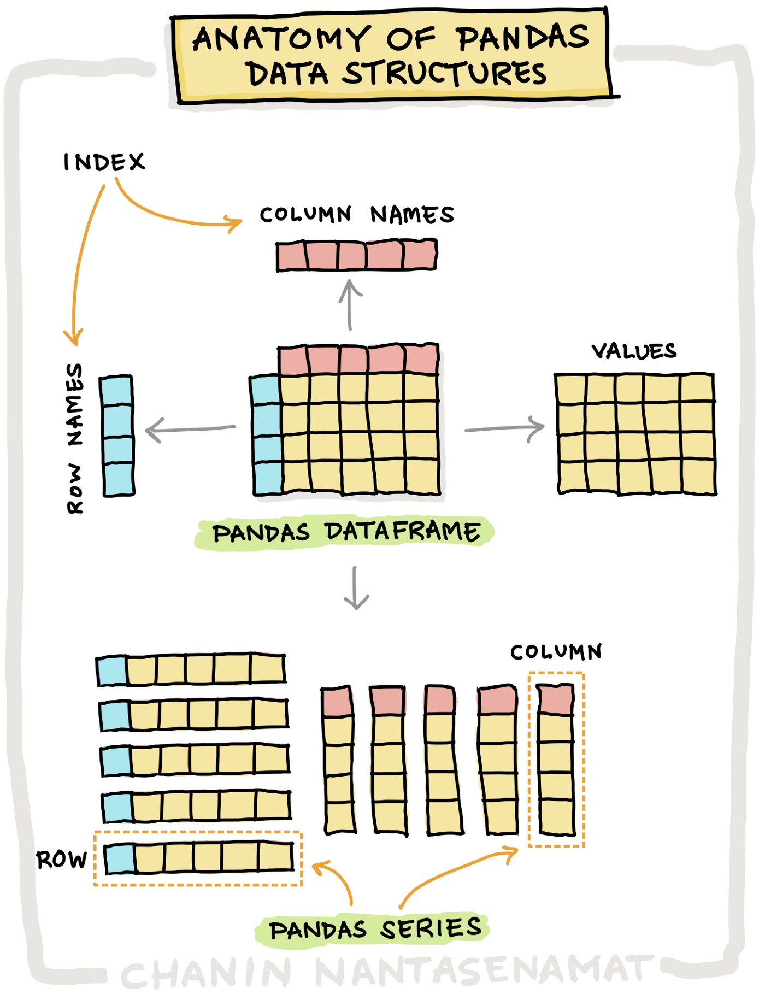

## Aprende a trabajar con datos de manera efectiva utilizando pandas, la librería de Python más popular para análisis de datos.

Pandas es una biblioteca de análisis de datos en Python que proporciona estructuras de datos flexibles y eficientes para trabajar con datos en formato tabular o estructurado.


Las dos estructuras de datos principales en Pandas son las **Series** y los **DataFrames**. 
- **Serie** es una matriz unidimensional etiquetada que puede contener cualquier tipo de datos.
- **DataFrame** es una estructura de datos bidimensional etiquetada que se compone de una o más Series. 

Los DataFrames son similares a las tablas en una base de datos y tienen filas y columnas.

----------



----------

Pandas proporciona una amplia variedad de herramientas para manipular y analizar datos, incluyendo:

- Selección de datos utilizando índices numéricos o etiquetas de fila y columna.

- Operaciones aritméticas y estadísticas en Series y DataFrames.

- Fusionar, unir y agrupar datos de múltiples fuentes.

- Importación y exportación de datos desde y hacia diferentes formatos, como CSV, Excel y SQL.

- Visualización de datos utilizando herramientas integradas o integrando con otras bibliotecas como Matplotlib y Seaborn.

----------
# Codeando ando

### Series
```python
# Importamos las librerías
import pandas as pd
#import matplotlib.pyplot as plt
```

```python
# Esto es una serie
my_series = pd.Series([1, 2, 3, 4, 5])
print(my_series)
```
```python
0    1
1    2
2    3
3    4
4    5
dtype: int64
```
### Dataframes
```python
# Ahora escribiremos el ejemplo en código
import pandas as pd #importamos la libreria pandas

data = {
    'Nombre': ['Juan', 'María', 'José', 'Ana', 'Ricardo', 'Laura', 'Diego', 'Marta', 'Carlos', 'Julia', 'Pedro', 'Elena', 'Pablo', 'Carmen', 'Luis', 'Sofía', 'Gabriel', 'Lucía', 'Hugo', 'Mariana'],
    'Edad': [12, 13, 12, 14, 13, 15, 12, 14, 13, 15, 14, 13, 12, 14, 13, 12, 14, 15, 13, 14],
    'Matemáticas': [90, 85, 80, 95, 88, 92, 78, 85, 89, 91, 83, 90, 87, 85, 88, 82, 79, 91, 84, 86],
    'Ciencias': [85, 90, 95, 92, 85, 89, 91, 83, 90, 87, 85, 88, 82, 79, 91, 84, 86, 80, 87, 90],
    'Historia': [95, 80, 85, 90, 92, 89, 84, 91, 82, 90, 86, 88, 85, 90, 89, 92, 87, 83, 86, 80]}

df = pd.DataFrame(data) #Declaramos el dataframe y le asignamos información

df
```

```python
     Nombre  Edad  Matemáticas  Ciencias  Historia
0      Juan    12           90        85        95
1     María    13           85        90        80
2      José    12           80        95        85
3       Ana    14           95        92        90
4   Ricardo    13           88        85        92
5     Laura    15           92        89        89
6     Diego    12           78        91        84
7     Marta    14           85        83        91
8    Carlos    13           89        90        82
9     Julia    15           91        87        90
10    Pedro    14           83        85        86
11    Elena    13           90        88        88
12    Pablo    12           87        82        85
13   Carmen    14           85        79        90
14     Luis    13           88        91        89
15    Sofía    12           82        84        92
16  Gabriel    14           79        86        87
17    Lucía    15           91        80        83
18     Hugo    13           84        87        86
19  Mariana    14           86        90        80
```